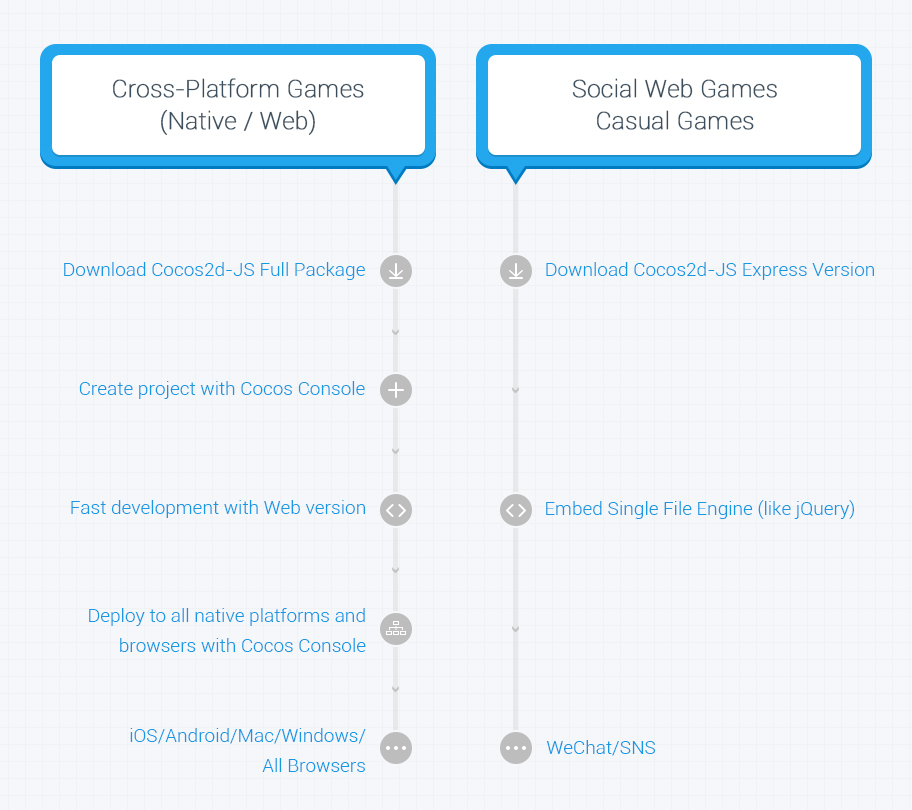

# Cocos2d-JS v3.0 Final release note

 

Cocos2d-JS is Cocos2d-x engine's JavaScript version that includes Cocos2d-html5 and Cocos2d-x JavaScript Bindings. It equips your game with cross-browser and cross-platform abilities, accompanied by full Cocos2d-x features and simplified JavaScript friendly APIs.

Cocos2d-JS reinvented workflows for all platforms in v3.0, it provides a consistent development experience for whichever platform you want to distribute to, no matter web and native. "Code once, run everywhere" is incredibly easy and natural in Cocos2d-JS. With one single JavaScript code base, you can run your game on all web browsers and native platforms including Mac OS, Windows, iOS and Android. This will bring your game great opportunities in almost all channels of distribution. On the other hand, if you are only interested in casual games on the web, you can embed directly in your web page the Cocos2d-JS Express Version which is extremely easy to use and light as a feather.

Furthermore, JavaScript friendly APIs make your game development experience a breeze - easy to code, test and distribute. In the meantime, Cocos2d-JS v3.0 is super powerful along with all these cool new features: Editors Support, Assets Manager, Object Pool, JS to Objective-C/JAVA reflection, etc.

## Workflows

- Cross platforms developers can use Cocos Console to create projects, boost their development with web version engine and deploy games onto all native platforms and all browsers with Cocos Console.

- Casual web game developers can download the Express Version and start to develop just like using other web frameworks (e.g. jQuery).

## Highlights

* One code base, run everywhere with unified Cocos2d-JS API.
* JavaScript style API refactorations: new construction, property APIs, simplified action APIs.
* Assets manager for assets and scripts hot update.
* Added new event manager to allow all kinds of objects to observe all event types.
* Added JavaScript to JAVA/Objective-C reflection support.
* Added Spine animations support.

## Notice

For JSB build, there are some restrictions :

- [Android build] NDK version must be r9d
- [iOS build] Xcode version must be 5.1.1 +

## Download

- [Cocos2d-JS v3.0 Final](http://www.cocos2d-x.org/filedown/cocos2d-js-v3.0.zip)
- [Cocos2d-JS v3.0 Express Version](http://www.cocos2d-x.org/filecenter/jsbuilder)
- [Online API reference](http://www.cocos2d-x.org/reference/html5-js/V3.0/index.html)
- [Downloadable API Reference](http://www.cocos2d-x.org/filedown/Cocos2d-JS-v3.0-API.zip)
- [Online test cases](http://cocos2d-x.org/js-tests/)

## More information

Read more about all the features and bug fixes

- [Cocos2d-JS v3.0 changelog](http://www.cocos2d-x.org/docs/manual/framework/html5/release-notes/v3.0/changelog/en)
- [Cocos2d-JS v3.0 upgrade guide](http://www.cocos2d-x.org/docs/manual/framework/html5/release-notes/v3.0rc0/upgrade-guide/en)

## About Cocos2d family

- Cocos2d-JS v3.0 uses Cocos2d-x 3.2 final as base of JSB solution
- Cocos2d-JS v3.0 is compatible with Cocos Code IDE v1.0.0 RC2+
- Cocos2d-JS v3.0 is compatible with Cocos Studio v1.2 - v1.5.0.1

With any problems you might have, our communities are happy to help:

- [Online forum](http://discuss.cocos2d-x.org/category/javascript)
- [Document root](http://cocos2d-x.org/docs/manual/framework/html5/en)
- [Github repository](https://github.com/cocos2d/cocos2d-js)

## Roadmap

Cocos2d-JS have greatly simplified cross platform development. For the next step, we will focus on improving performance on mobile web, toolchain enhancement and completing documentation. Here is a list of main tasks we consider to accomplish in v3.1 :

- The research for performance improvement on Web engine have already made great progress, the new renderer for canvas render mode is ready and will be merged in v3.1. The performance is upto 50% better than v3.0 based on various tests.
- Facebook SDK for Cocos2d-JS will be released with v3.1, developers can use all Facebook features on iOS/Android/Web with the same JavaScript code.
- Continue the research of memory model in JSB, improve the stability and simplify the usage.
- Complete the Cocos2d-JS Programming Guide document to cover all important aspects about Cocos2d-JS development.